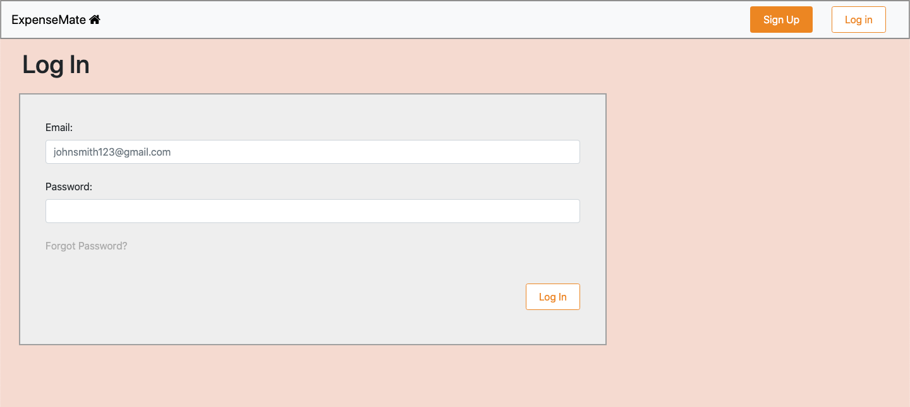
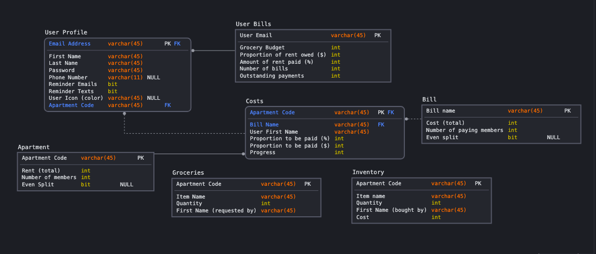

# [ExpenseMate](https://cs326-gamma.herokuapp.com/)

## Team Gamma - Fall 2020

## Team Overview

- Leon Djusberg: @LeonDJ7
- Hannah Noordeen: @hannahnoordeen
- Bryce Parkman: @bryceparkman

## Overview

ExpenseMate is a website to help people track their apartments' or households' shared monthly expenses. The main features of the site are pages to manage progress made on monthly bills, such as rent and utilities, and a running grocery list and inventory of the goods needed and bought by the users of the apartment/household. Users start by creating an account and then either joining, or creating, an apartment where they can define the costs of each of the apartment's bills; and expenses can be dividied up evenly or proportionally depending on what the housemates set. Once created, the apartment overview page lets users see their personal progress on their bills as well the apartment's overall progress on expenses. By tracking all apartment expenses, people no longer feel like they are paying more or less than their share because every apartment expense is documented and easily readable. The site solves a challenge many young people face when living with a group of people - especially for those who aren't used to managing expenses. It allows for an objective financial breakdown of shared expenses and the running grocery list solves the problem of overbuying and miscommunication which saves all users time and money.

## User Interface

Homepage: This is the homepage of the site where user's can read about what the site does as well as sign up or log in.

Login Page: This is the login page for existing users.

Signup Page: This is the signup page to create a new user.

Costs Page: This page is for tracking payments on bills and for adding new payments.

Groceries Page: This page is for keeping track of groceries needed and an inventory of what's in the apartment. User's can add new items to the grocery list or see what's currently in the apartment's inventory.

Apartment Creation Page: This page is for creating a new apartment. Users can define the monthly rent as well as add other bills to the apartment.

Apartment Overview Page: This page is for tracking the progress of each bill for the apartment.

## APIs

| API Route            | Request Type | Description                                                  |
|----------------------|--------------|--------------------------------------------------------------|
| /payments/:type      | GET          | Returns a user's payment data for a specific bill            |
| /cost/:type          | GET          | Returns a bills monthly cost                                 |
| /name/:email         | GET          | Returns a users name given their email                       |
| /addPayment          | POST         | Adds a payment amount to a bill                              |
| /share/:email        | GET          | Returns the number of users in an apartment                  |
| /budget/:email       | GET          | Returns a user's grocery budget                              |
| /bill/:email         | GET          | Returns how much a user has spent on groceries               |
| /addBill             | PUT          | Adds an amount spent to the user's grocery bill.             |
| /groceries           | GET          | Returns a list of groceries for the apartment                |
| /inventory           | GET          | Returns a list of the apartment's inventory                  |
| /addGrocery          | POST         | Adds a new grocery item to the apartment's grocery list.     |
| /addInventory        | POST         | Adds a new inventory item to the apartment's inventory list. |
| /editGrocery         | PUT          | Updates a grocery item (name or amount)                      |
| /editInventory       | PUT          | Updates an inventory item (name or amount)                   |
| /removeGrocery/:id   | DELETE       | Removes a grocery item from apartment grocery list           |
| /removeInventory/:id | DELETE       | Removes an inventory item from apartment inventory list      |
| /aptCosts/:id        | GET          | Returns a list of user's payments on utility bills           |
| /addAptCost          | POST         | Adds a new utility bill                                      |
| /editAptCost         | POST         | Edits the name/cost/contributers for a bill                  |
| /removeAptCost       | DELETE       | Deletes a bill from the apartment                            |
| /allAptCodes         | GET          | Returns the apartment's ID                                   |
| /allUsersInApt/:id   | GET          | Returns the user data for all users in the apartment         |
| /createApartment     | POST         | Adds the starting apartment information                      |
| /profiles            | GET          | Returns a list of all user profiles                          |
| /loginProfile/:email | GET          | Returns a password for a given user                          |
| /email/:email        | GET          | Returns if a new user's email is unique                      |
| /userProfile         | POST         | Adds a new user's profile                                    |

## Database

*  User Profiles contains each user's personal information including their name, email, password, phoneNumber, profile color, and their apartment's ID.
*  User Grocery Bills contains a user's grocery budget and what they've spent using an email as a user's identifier.
* User Payments tracks the progress a user has made on each of their bills.
*  Apartment contains all the information about a group's apartment as defined in the apartment creation page. 
*  Costs is for tracking the overall apartment progress on each shared bill.
* Utility Bills contains the cost of the other (non-rent) bills for the apartment.
*  Groceries contains the list of groceries bought/needed for an apartment. 
*  Inventory is a table the contains all the grocieries/goods that are in the apartment (have been bought). 

## URL Routes/Mappings

A final up-to-date table of all the URL routes that your application supports and a short description of what those routes are used for. You should also indicate any authentication and permissions on those routes.

## Authentication/Authorization

A final up-to-date description of how users are authenticated and any permissions for specific users (if any) that you used in your application. You should mention how they relate to which UI views are accessible.

## Division of Labor: 

Leon worked on:

Hannah worked on:

Bryce worked on: 

## Conclusion

A conclusion describing your team’s experience in working on this project. This should include what you learned through the design and implementation process, the difficulties you encountered, what your team would have liked to know before starting the project that would have helped you later, and any other technical hurdles that your team encountered.
