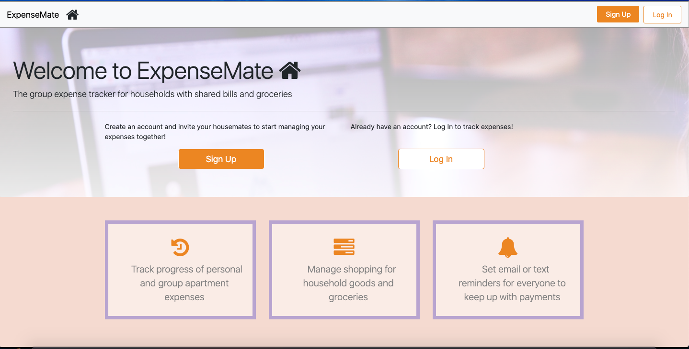
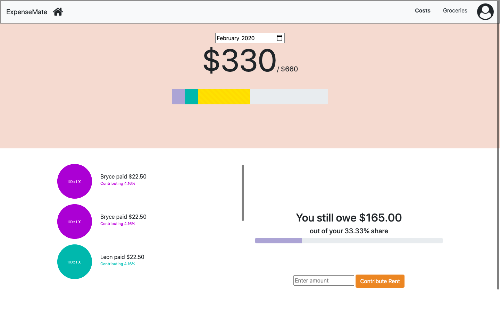
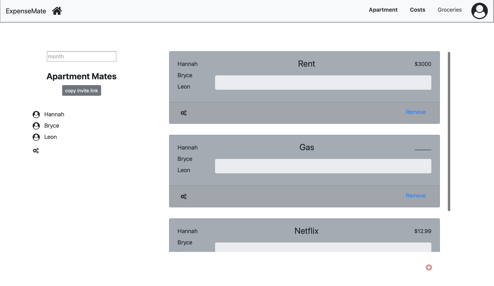

# Milestone 1: Project Wireframes

## Part 0

Same as from the [ideas.md markdown](ideas.md). 

## Part 1

[Home page wireframe](https://whimsical.com/NZejN5u5xHRzn37JEGthho)

[Create User page wireframe](https://whimsical.com/BL5xQmRKvS9rYC4s8Bewb3)

[Costs page wireframe](https://whimsical.com/WF8wnRiJi1C3EoHRsHcNc5)

[Groceries page wireframe](https://whimsical.com/9hKTvUntwrP3hJwFBvWYDD)

[Apartment creation page wireframe](https://whimsical.com/PHmW8DEb4jYN7rgyRUkvV2)

[Apartment overview wireframe](https://whimsical.com/2TTvmsLrTYygTqupfowRFv)

## Part 2 
Homepage

Login page

Signup

Costs page

Groceries page

Apartment creation page

Apartment overview page

## Division of Labor

Bryce worked on creating the initial files for the repository and creating the wireframes and the HTML/CSS for the Costs page and the groceries page.

Leon worked on creating the wireframes and HTML/CSS files for the apartment creation page, and apartment overview page. 

Hannah worked on creating the wireframes and HTML/CSS files for the home page, sign up page, and log in page. 
