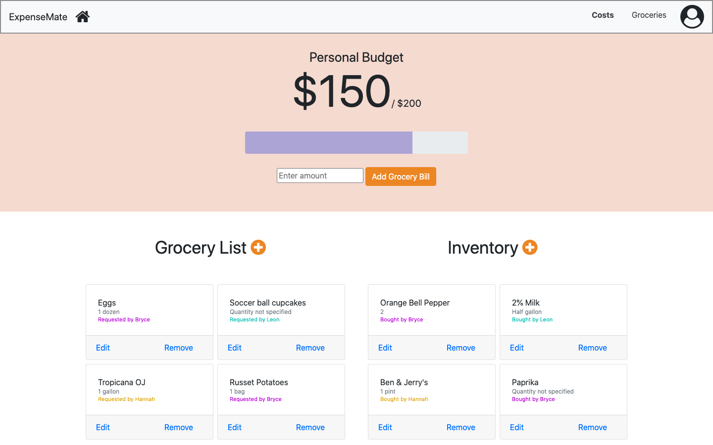

# Milestone 2: Front-end JavaScript

## Part 0

**API Endpoints**

GET Requests: 

/loginProfile This request returns a user password for a username to verify a user on the login page. Input: username or email. Output: User password

/rentPayments A list of payments that have been made by all apartment members.

/rent Get's the apartment's overall rent costs per month.

/rentShare:user Gets a certain user's contribution percentage towards the total rent cost.

/budget:user Gets a certain user's grocery budget

/bill:user Gets a certian user's bill so far for the month

/groceries: Gets a list of all groceries requested for the apartment

/inventory: Gets a list of the inventory items for the apartment

POST Requests:

/userProfile This request goes from the create user profile page to the user profile table. Input data: user name, email, and apartment code. Outputs a message saying successfully created user.

/apartmentProfile This request goes from the apartment creation page to the apartment table. Input data: apartment code, total rent, number of members. Outputs a message saying successfully created apt.

/newBill This request goes from the apartment creation page to the bills table. Input Data: Bill name, cost, and how many people are paying the bill. The output is the bill added to the apartment overview page.

/addPayment Adds a payment to the ongoing list of payments

/addGrocery Adds a grocery item to the list of apartment groceries

/addInventory Adds an inventory item to the apartment's inventory.

PUT Requests:

/addBill This request adds a user's grocery bill to the running total for the month.

/editGrocery This request edits a current entry of the groceries list

/editInventory This request edits a current entry of the apartment's inventory

DELETE Requests:

/removeGrocery This request removes a current entry of the groceries list

/removeInventory This request removes a current entry of the apartment's inventory

**Data Model**

Our web page has six major components: User Profiles, Apartment, Bills, Costs, Groceries, and Inventory. 

*  User profiles contain each user's personal information including the  initial setup data as well as the progress on their payments. 
*  Apartments contains all the information about a group's apartment as defined in the apartment creation page. 
*  Bills is a table where each entry is a defined bill shared by the apartment (electric, wifi, etc). 
*  Costs is a table showing how much of each bill each user pays. 
*  Groceries contains the list of groceries bought/needed for an apartment. 
*  Inventory is a table the contains all the grocieries/goods that are in the apartment (have been bought). 

## Part 2
Costs page

The costs page uses create and read API endpoints. The 'Contribute Rent' button triggers a create endpoint to add the payment to the databases stored payments, and the read endpoints are used to get the total apartment costs and individual user contribution percentage.

Groceries page

The groceries page implements the full CRUD API. The plus button creates a new item to the database of groceries / inventory respectively. The individual user budgets, groceries, and inventory implement a read api call. The edit function on the cards implements the update API, and the remove implements the delete API.

## Part 3

[Heroku website](https://cs326-gamma.herokuapp.com/)

## Division of Labor

Bryce worked on groceries.js, costs.js, and routes in server.js for these files.

Leon worked on

Hannah worked on 