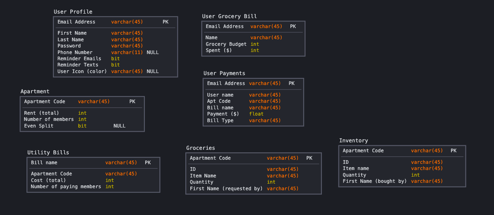

**Data Model**

Our web page has seven major components: User Profiles, User Grocery Bills, Apartment, User Payments, Utility Bills, Groceries, and Inventory. 

*  User profiles contain each user's personal information including the  initial setup data as well as the progress on their payments. 
    *  Each field is an input field on the Sign Up Page

*  User Grocery Bill contains the data for a user's grocery spending
    *  email is the primary key to id the user
    *  name is the users first name
    *  grocery budget is the user's total grocery budget ($)
    *  spent is how much the user has spent on groceries so far

*  Apartment contains all the information about a group's apartment as defined in the apartment creation page. 
    *  Apartment code is the apartment identifier
    *  Rent is the total rent of the apartment
    *  nummembers is how many people live in the apartment

*  User Payments contains all the user payment data
    *  Email address is the primart key to determine whose payment data it is
    *  name is the user's first name
    *  aptcode is the code for which apartment the user is in
    *  billname is the name of the bill which the payment is for
    *  payment is for each new payment a user has made ($)
    *  bill type is whether the bill is rent or utility

*  Utility Bills is the bill cost definitions for each non-rent bill in the apartment
    *  Bill name is the name of the bill
    *  Apartment Code is the code for which apartment the bill is in
    *  Cost is the total bill cost
    * nummembers is how many members are contributing to the bill

*  Groceries contains the list of groceries bought/needed for an apartment. 
    *  Apartment code is the primary key to identify which apartment the grocery list is for
    *  name is the name of the grocery item
    *  quantity is the amout of that item
    *  requestedby is the first name of whoever requested the item

*  Inventory is a table the contains all the grocieries/goods that are in the apartment (have been bought). 
    *  Apartment code is the primary key to identify which apartment the grocery list is for
    *  name is the name of the item added to inventory
    *  quantitiy is the amount of that item that was bought
    *  boughtby is the name of whoever bought the item
    *  cost is how much the item cost

## Division of Labor

Bryce worked on creating the SQL routes for each of the routes associated with the costs and groceries pages. Also worked on deploying to Heroku and adding Postgres to the deployed version. Added the secrets.json logic and fixed minor bugs affecting the multi-user interactions on the costs and groceries pages.

Leon worked on 

Hannah worked on creating the SQL routes for each of the routes associated with the signup and login pages as well as wrote the data model descriptions.